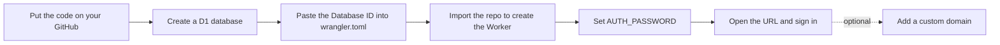

<p align="right"><a href="./deploy-dashboard.md">简体中文</a> | English</p>

# MD Notes — Dashboard Deployment Guide (no command line)

This guide is for people who don't want to install Node.js or wrangler and would rather deploy by clicking through a browser. It is free and takes 3–10 minutes.

The Cloudflare dashboard deploys Workers by "connecting a Git repository and building on every change", so you need a GitHub account in addition to a Cloudflare account. Both are free.

> Button names follow Cloudflare's English UI. You can switch the dashboard language from the avatar menu in the top-right corner.

## What you need

| Item | Where | Notes |
| --- | --- | --- |
| Cloudflare account | <https://dash.cloudflare.com/sign-up> | Free plan is enough; no credit card required |
| GitHub account | <https://github.com/signup> | Free |
| A password | Make one up | 16+ random characters — it is the only key to your notes |

## Overview



Two ways to get there:

- **Route A: Deploy button** — Cloudflare does steps A–E for you; you only type the password on one page. Fastest, recommended.
- **Route B: Manual import** — click through every step yourself. Good if you want to understand each part, or if the button isn't available.

---

## Route A: Deploy button (about 3 minutes)

Prerequisite: the project repository is public on GitHub. (The button in the README points to `github.com/JamesZhaoY/md-notes`; if you use your own public fork, replace the repository URL in the button link.)

1. Click **Deploy to Cloudflare** at the top of the README, or open:
   `https://deploy.workers.cloudflare.com/?url=https://github.com/JamesZhaoY/md-notes`
2. Sign in to Cloudflare. The first time, you'll be asked to **Connect GitHub**; on GitHub's authorization page choose which repositories Cloudflare may access (All repositories, or just the one about to be created) and click **Install & Authorize**.
3. Back on Cloudflare's setup page, confirm or edit:
   - **Repository name** — Cloudflare copies the code into a new repository under your account, `md-notes` by default.
   - **Worker name** — `md-notes` by default; it determines the URL `https://md-notes.<your-subdomain>.workers.dev`.
   - **D1 database** — named `md-notes` by default; Cloudflare creates it for you.
   - **Secrets** — `AUTH_PASSWORD` is listed here. **Enter your password.**
4. Click **Create and deploy**. The page shows build progress; **Success** appears after about a minute.
5. Click the URL on the page (or find `md-notes` under **Workers & Pages**), enter the password from step 3, and start writing.

To change the code later, edit and commit in your copy of the repository on GitHub; Cloudflare redeploys automatically.

> If step 3 didn't show an `AUTH_PASSWORD` field, add it after deployment following [Route B, step 6](#step-6-set-the-login-password).

---

## Route B: Manual import (about 10 minutes)

### Step 1: Put the code on your GitHub

Choose one:

**Fork (if the code is already on GitHub)**
Open the project repository → **Fork** in the top-right → **Create fork**. A copy of `md-notes` appears under your account.

**Upload (if the code is on your computer)**
1. GitHub → **+** in the top-right → **New repository** → Repository name `md-notes` → **Public** or **Private**, either works → **Create repository**.
2. On the new repository page click **uploading an existing file** (or **Add file → Upload files**).
3. Drag the **entire contents** of the project folder into the upload area: the `src`, `public`, `docs` and `scripts` folders plus `wrangler.toml`, `package.json`, `package-lock.json`, `schema.sql`, `.gitignore`, `.dev.vars.example`, `LICENSE`, `README.md` and `README.en.md`. Do **not** upload `node_modules`, `.wrangler` or `.dev.vars`.
   - Chrome and Edge keep the folder structure when you drag folders; Safari needs each subfolder uploaded separately.
4. Click **Commit changes** at the bottom.

Afterwards the repository root should show `wrangler.toml`, `src/index.js`, `public/index.html`, etc.

### Step 2: Create the D1 database

1. Open <https://dash.cloudflare.com> → left sidebar **Storage & Databases** → **D1 SQL Database**.
   Direct link: <https://dash.cloudflare.com/?to=/:account/workers/d1>
2. Click **Create Database**.
3. **Name**: `md-notes` (must match `database_name` in `wrangler.toml`). **Location**: leave Automatic.
4. Click **Create**.
5. Open the new database and find the **Database ID** in the overview (a string like `xxxxxxxx-xxxx-xxxx-xxxx-xxxxxxxxxxxx`). Click the copy icon next to it.

No need to create tables here; the Worker creates them on its first request.

### Step 3: Paste the Database ID into wrangler.toml

1. Back in your `md-notes` repository on GitHub, open `wrangler.toml`.
2. Click the pencil icon **Edit this file** in the top-right.
3. Find these lines:
   ```toml
   [[d1_databases]]
   binding = "DB"
   database_name = "md-notes"
   database_id = ""
   ```
   Paste the ID from step 2 between the quotes of `database_id = ""` so it becomes:
   ```toml
   database_id = "xxxxxxxx-xxxx-xxxx-xxxx-xxxxxxxxxxxx"
   ```
4. **Commit changes…** in the top-right → **Commit changes** again.

> Why by hand? Dashboard deployments run with an API token that Cloudflare generates automatically. It can manage Workers but has no permission to create D1 databases, so the automatic provisioning that the CLI enjoys isn't available here. With the ID filled in, the deployment never needs to call the D1 API at all.

### Step 4: Create the Worker from the repository

1. Left sidebar **Workers & Pages** → **Create application** in the top-right.
2. Stay on the **Workers** tab, find **Import a repository**, and click **Get started**.
3. Choose a **Git account**. The first time, GitHub asks you to install the **Cloudflare Workers & Pages** app: choose **Only select repositories** and tick `md-notes` (or All repositories), then **Install & Authorize**.
4. Back on Cloudflare, pick **md-notes** from the repository list (there is a search box).
5. Fill in the build settings (Set up your build):

   | Field | Value | Notes |
   | --- | --- | --- |
   | **Project name** | `md-notes` | **Must exactly match `name` in `wrangler.toml`**, or the build fails |
   | **Production branch** | `main` | Default. Use `master` if that is your repository's default branch |
   | **Build command** | leave empty | This project has no build step |
   | **Deploy command** | `npx wrangler deploy` | Default, leave as is |
   | **Root directory** | leave empty | The code is at the repository root |
   | **Build variables and secrets** | leave empty | These are build-time variables, **not** the runtime `AUTH_PASSWORD` — that comes in step 6 |

6. Click **Save and Deploy**.

### Step 5: Wait for the build

The page switches to the Worker's **Deployments** view with build progress. Cloudflare runs `npm install` and then `npx wrangler deploy`; a green **Success** usually appears within a minute.

The Worker page then shows the URL `https://md-notes.<your-subdomain>.workers.dev`. Open it — the page will say **the server has no password configured yet**. That is expected: the deployment worked, only the password is missing.

If the build fails, open its log and check [Common errors](#common-errors) below.

### Step 6: Set the login password

1. On the Worker page open the **Settings** tab.
2. Under **Variables and Secrets** click **Add**.
3. **Type**: **Secret**. **Variable name**: `AUTH_PASSWORD`. **Value**: your password.
4. Click **Deploy**. Cloudflare republishes the Worker with the new variable; it takes effect within seconds.

> Once the type is Secret, the value is hidden in both the dashboard and the CLI — it can be overwritten but never read back, so keep your own record of the password.

### Step 7: Sign in

Reload the URL, enter the password, and you're in. The table is created automatically on first use.

- **+** in the top-left creates a note; it saves as you type
- **Edit / Split / Preview** at the top switch views
- **Export** downloads the current note as `.md`
- Open the same URL in a phone browser to use it there, or "Add to Home Screen"

### Step 8 (optional): Add your own domain

The `workers.dev` domain is unreliable in some regions. If you own a domain whose DNS is on Cloudflare:

1. Worker page → **Settings** → **Domains & Routes** → **Add** → **Custom Domain**.
2. Enter a subdomain such as `notes.example.com` → **Add domain**.
3. Wait for the status to become Active (usually under a minute); the certificate is issued automatically. Use that domain from now on.

---

## Day-to-day

| Task | How |
| --- | --- |
| Update the code | Edit and commit on GitHub; Cloudflare rebuilds and deploys automatically. You can also go to Worker → **Deployments** → **View build history** at the bottom → **⋯** next to a build → **Retry build** |
| Change the password | Worker → **Settings** → **Variables and Secrets** → edit `AUTH_PASSWORD` → new value → **Deploy**. Every device has to sign in again |
| Browse the data | **Storage & Databases** → **D1 SQL Database** → `md-notes` → **Tables** → `notes` shows every row; **Console** runs SQL |
| Back up | Run `SELECT * FROM notes` in the D1 **Console** and export the result; or **Export** notes one by one in the app; or script a bulk export with the API described in the README |
| View logs | Worker → **Observability** (or **Logs**) tab shows each request and any `console.error` output |
| Check usage | Worker → **Metrics**; D1 → database page → **Metrics** |
| Start over | Worker → **Settings** → **Delete** at the bottom; D1 → database → **Settings** → **Delete** |

## Common errors

**Build log says `The name in your Wrangler configuration file (md-notes) must match the name of your Worker`**
The Project name from step 4 differs from `name = "md-notes"` in `wrangler.toml`. Either change `name` in `wrangler.toml` on GitHub to your project name, or delete the Worker and import again with the project name `md-notes`.

**Build log shows a D1 error such as an invalid `database_id`, `couldn't find a D1 DB` or `not found`**
Step 3 was skipped, the ID is wrong, or it has stray spaces. Make sure `database_id` matches the ID on the D1 page exactly and commit; the build reruns automatically.

**Build log says `Missing entry-point` or can't find `wrangler.toml`**
The files from step 1 aren't at the repository root (for example, there's an extra `md-notes/` folder). Move the files to the root, or set that folder as Root directory under Worker → **Settings** → **Build**.

**The page keeps saying the server has no password configured**
Step 6 wasn't done, the variable name is misspelled (it must be `AUTH_PASSWORD` in capitals), or you didn't click **Deploy** after adding it.

**"Wrong password" even though it's correct**
Secrets take effect after the redeploy; wait a few seconds and retry. If `AUTH_PASSWORD` is also set under `[vars]` in `wrangler.toml`, the two conflict — keep only one.

**The URL doesn't load / is very slow**
`workers.dev` is disrupted in some regions; add your own domain as in step 8.

**My repository isn't listed on GitHub's authorization page**
The Cloudflare Workers & Pages app was installed with Only select repositories, without this one. GitHub → Settings → Applications → Cloudflare Workers & Pages → Configure, and add it.

## Cost

Everything above fits in Cloudflare's free plan: Workers 100,000 requests/day (static files don't count), D1 5 GB storage and 100,000 writes/day, Workers Builds 3,000 build minutes/month. Personal notes come nowhere near those limits, and no credit card is needed. Quotas are subject to the [official pricing page](https://developers.cloudflare.com/workers/platform/pricing/).
